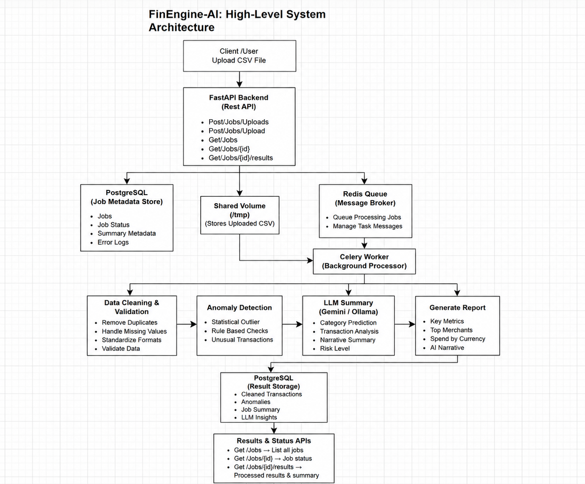

# FinEngine-AI: AI-Powered Financial Transaction Processing Pipeline

An AI-powered transaction processing pipeline that automates financial data cleaning, anomaly detection, transaction categorization, and reporting through a scalable microservice architecture.

## Overview

FinEngine-AI is designed to process raw transaction datasets asynchronously using FastAPI, Celery, PostgreSQL, Redis, and Docker. The system cleans incoming financial data, detects anomalies, generates analytical summaries, and exposes results through REST APIs.

The project demonstrates backend engineering, data processing, asynchronous task execution, containerization, and AI integration concepts.

## Key Highlights

- Asynchronous CSV Processing Pipeline
- Dockerized Microservice Architecture
- Redis + Celery Background Processing
- Financial Data Cleaning & Validation
- Statistical Anomaly Detection
- AI-Powered Transaction Analysis
- RESTful API Design


## Features

### Data Cleaning

* Removes duplicate records
* Standardizes date formats
* Normalizes currency values
* Handles missing fields
* Standardizes status and currency casing

### Anomaly Detection

* Detects statistical outliers using account median spending
* Flags suspicious transactions
* Generates anomaly explanations

### Transaction Categorization

* Supports AI-assisted category classification
* Handles uncategorized transactions
* Maintains structured financial categories

### Reporting

* Generates transaction summaries
* Calculates spending breakdowns
* Tracks anomaly counts
* Produces structured JSON responses

### Asynchronous Processing

* Background job execution with Celery
* Redis-based task queue
* Job tracking and status monitoring

### REST API

* Upload transaction datasets
* Monitor processing status
* Retrieve processed results
* View historical jobs


## Tech Stack

| Component        | Technology              |
| ---------------- | ----------------------- |
| Backend API      | FastAPI                 |
| Task Queue       | Celery                  |
| Message Broker   | Redis                   |
| Database         | PostgreSQL              |
| Data Processing  | Pandas                  |
| Containerization | Docker & Docker Compose |
| AI Integration   | Google Gemini API       |
| ORM              | SQLAlchemy              |


## Project Architecture



---

## API Endpoints

### Upload CSV

POST /jobs/upload

Uploads a transaction dataset and starts background processing.

### Check Status

GET /jobs/{job_id}/status

Returns current processing status.

### Retrieve Results

GET /jobs/{job_id}/results

Returns processed transactions, anomalies, and summaries.

### List Jobs

GET /jobs

Returns all submitted jobs.

---

## Running with Docker

Build and start services:

```bash
docker compose up --build
```

API will be available at:

```text
http://localhost:8000
```

---

## Example Workflow

1. Upload a CSV file.
2. FastAPI creates a processing job.
3. Celery processes data asynchronously.
4. Results are stored in PostgreSQL.
5. Client retrieves processed output through API endpoints.

---

## Future Enhancements

* Local LLM integration using Ollama
* Authentication and authorization
* Dashboard visualization
* Advanced fraud detection models
* Export reports in PDF and Excel formats

---

## Author

Muhammad Usman

BS Computer Science Student passionate about Full-Stack Development, Backend Systems, Data Processing, and AI-Powered Applications.